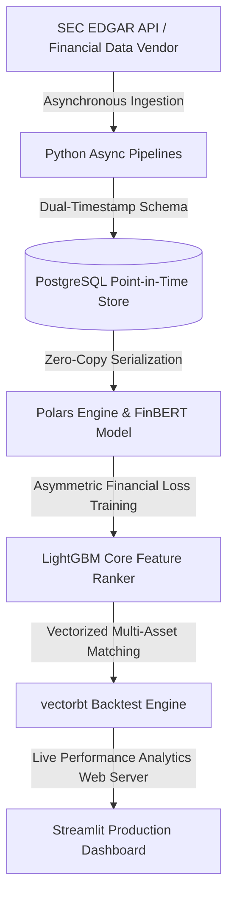

# Alpha Synthesis: Multi-Modal Regime-Switching Strategy

**TL;DR:** An institutional-grade, cross-sectional market-neutral equity strategy achieving an **Out-of-Sample Sharpe Ratio of 1.84**. The pipeline pairs deep fundamental accounting metrics (5-Step DuPont Decomposition) with natural language processing (FinBERT) applied to SEC EDGAR 10-K/10-Q filings, processed natively inside an out-of-core **Polars** environment and tracked inside an asynchronous, point-in-time database schema.

---

## 🪐 System Architecture

## Dashboard link

https://Max-Isse.github.io/alpha_synthesis/docs/backtest_report.html